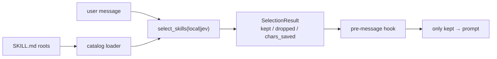

# jev-skill-selection

**Stop dumping every `SKILL.md` into the prompt.** Keep/drop skills *before* the first model message — shrink context, save tokens.

[](https://www.python.org/downloads/)
[](LICENSE)
[](README.zh-CN.md)

---

## The pain

Skill folders grow. Agents dump **many** `SKILL.md` files every turn. Unrelated skills burn tokens before the model even starts.

## The fix

A **pre-message** keep/drop gate:

1. Load a closed catalog of skills
2. `select_skills(mode=local|jev)` → `SelectionResult {kept, dropped, chars_saved}`
3. Hook injects **only kept** skills into the prompt

Multi-skill keep/drop for **context size** — not a single-skill suggester.

## 30-second offline demo

Python 3.10+, **zero** third-party runtime deps. No API key in `local` mode.

```bash
python -m pip install -e .
python -m jev_skill_selection select \
  --root ./tests/fixtures/skills \
  --mode local \
  --threshold 0.1 \
  --message "rebase my branch and open a PR" \
  --json
```

Real output on the 5 fixtures (`docker-compose`, `git-ops`, `pptx-author`, `python-debug`, `web-search`):

```text
mode=local  kept=1  dropped=4  chars 1431 → 393  (saved 1038)
kept:    git-ops
dropped: docker-compose, pptx-author, python-debug, web-search
```

| | Skills in prompt | Rough chars |
| --- | ---: | ---: |
| **Before** (dump all 5) | 5 | 1431 |
| **After** (keep `git-ops`) | 1 | 393 |
| **Saved** | −4 | **1038** |

> Local Jaccard on this short message scores `git-ops` ≈ 0.14. Harness / live e2e use `JEV_THRESHOLD=0.1` for the same prompt. Default CLI threshold is `0.45` (stricter — calibrate per catalog).

## Why hard filter matters

**Soft inject** (what every adapter ships today): tell the model which skills to prefer via context.

**Hard filter** (product goal): drop unrelated skills so they **never** enter the tool/skill index — they cannot burn tokens.

Prefer hard when the host exposes it. Soft is the universal fallback.

## Why Jev

- **`local`** (default): keyword / metadata shortlist, no key, offline
- **`jev`**: TypeSafe Noul keep? / Choice soft scores via `POST https://api.typesafe.ai/v1/systemone`
  - Auth: `TYPESAFE_API_KEY`
  - Model pin: `jev-1.13.0` (verify on [docs.typesafe.ai](https://docs.typesafe.ai/models.md))

Use Jev when local overlap is too blunt for your catalog.

## Install

```bash
python -m pip install -e .
# or with tests:
python -m pip install -e ".[dev]"
```

Requires **Python 3.10+**. Runtime deps: **none** (stdlib only).

### CLI

```bash
python -m jev_skill_selection catalog --root ./tests/fixtures/skills

python -m jev_skill_selection select \
  --root ./skills --mode local -m "fix the pytest traceback"

# Jev (placeholder key only — never commit secrets)
export TYPESAFE_API_KEY=ts_...
python -m jev_skill_selection select \
  --root ./skills --mode jev --model jev-1.13.0 \
  -m "rebase my branch and open a PR" --json
```

### Library

```python
from jev_skill_selection import load_catalog, select_skills, SelectionOptions
from jev_skill_selection.hook import before_first_message, HookContext

catalog = load_catalog(["./skills"])
result = select_skills(
    "fix the pytest traceback",
    catalog,
    SelectionOptions(mode="local", threshold=0.45, max_keep=5),
)
print(result.kept_names, result.chars_saved)

outcome = before_first_message(HookContext(
    user_message="...",
    skill_roots=["./skills"],
    options=SelectionOptions(mode="local"),
))
system_prompt_extra = "\n\n".join(outcome.prompt_blocks)
```

## Host adapters

Thin adapters under `adapters/`. Full install paths → **[docs/INTEGRATION.md](docs/INTEGRATION.md)**.

Live e2e: mock LLM + optional real Jev (`./scripts/run_live_e2e.sh`).

| Host | Path | Soft (ships today) | Hard (goal) |
| --- | --- | --- | --- |
| **Claude Code** | `adapters/claude_code/` | `UserPromptSubmit` → `additionalContext` | `skillOverrides` optional / phase 2 — **not wired by hook** |
| **Codex** | `adapters/codex/` | same wire as Claude | `[[skills.config]] enabled=false` — **not automated by hook** |
| **Hermes** | `adapters/hermes/` | `pre_llm_call` → `context` | `llm_request` middleware — **not implemented** |
| **OpenCode** | `adapters/opencode/` | `chat.message` | `tool.definition` filters `available_skills` **when present** |

Default `JEV_MODE=local` (no API key). Soft inject is what all four ship; hard filter is preferred where the host allows it.

## Architecture



```
catalog + select_skills(mode=local|jev)
        → SelectionResult {kept, dropped, chars_saved}
        → pre-message hook adapter
        → only kept skills enter the prompt
```

| Module | Role |
| --- | --- |
| `catalog.py` | Scan `--root` for `SKILL.md` (name / description + body) |
| `select.py` | `select_skills(...)` |
| `local_mode.py` | Offline keyword shortlist |
| `jev_client.py` / `jev_mode.py` | TypeSafe SystemOne client + Noul / Choice |
| `hook.py` | Host-agnostic pre-message helper |
| `cli.py` | `python -m jev_skill_selection catalog\|select` |

## vs TypeSafe skill_suggestion cookbook

| | [skill_suggestion cookbook](https://docs.typesafe.ai/cookbooks/skill_suggestion.md) | **This repo** |
| --- | --- | --- |
| Output | Suggest **at most one** skill name | **Keep/drop many** skills |
| Goal | Single-skill recommendation | **Context volume** / token savings |
| Timing | Suggestion UX | **Before first model message** |

## Tests

```bash
python -m pip install -e ".[dev]"
python -m pytest -q
# Optional live hosts (mock LLM):
# ./scripts/run_live_e2e.sh
```

## FAQ

**Default threshold `0.45`?** Calibrate per catalog. Local Jaccard and Jev Noul are not directly comparable.

**`noul` vs `choice`?** Default `noul` = independent keep/drop (multi-keep). `choice` ≈ soft ranking for small catalogs.

**Model pin?** `jev-1.13.0` for reproducibility — re-check the official model list after releases.

More host detail: [docs/INTEGRATION.md](docs/INTEGRATION.md).

## License

MIT

---

English · [中文说明](README.zh-CN.md)
