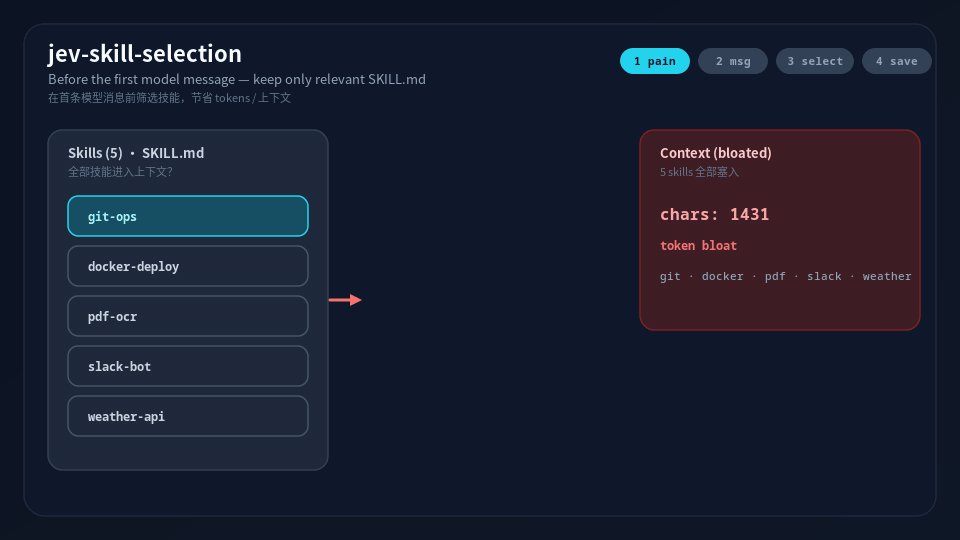
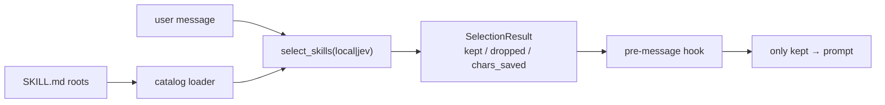

# jev-skill-selection

**别再把每个 `SKILL.md` 都塞进提示词。** 在第一条模型消息之前做 keep/drop —— 压缩上下文，省 token。

[](https://www.python.org/downloads/)
[](LICENSE)
[](README.md)

---

## 痛点

技能目录越长，agent 越容易**每轮倾倒大量** `SKILL.md`。无关技能在模型开口前就烧掉 token。

## 做法

**消息前** keep/drop 闸门：

1. 加载封闭技能目录（catalog）
2. `select_skills(mode=local|jev)` → `SelectionResult {kept, dropped, chars_saved}`
3. Hook **只把保留的**技能注入提示词

对**多个**技能做保留/丢弃，服务的是**上下文体积** —— 不是单技能推荐器。

## 原理



## 30 秒离线演示

Python 3.10+，运行时**零**第三方依赖。`local` 模式无需 API key。

```bash
python -m pip install -e .
python -m jev_skill_selection select \
  --root ./tests/fixtures/skills \
  --mode local \
  --threshold 0.1 \
  --message "rebase my branch and open a PR" \
  --json
```

在 5 个 fixture（`docker-compose`、`git-ops`、`pptx-author`、`python-debug`、`web-search`）上的真实输出：

```text
mode=local  kept=1  dropped=4  chars 1431 → 393  (saved 1038)
kept:    git-ops
dropped: docker-compose, pptx-author, python-debug, web-search
```

| | 进入提示词的技能 | 约计字符 |
| --- | ---: | ---: |
| **之前**（全量 5 个） | 5 | 1431 |
| **之后**（只留 `git-ops`） | 1 | 393 |
| **节省** | −4 | **1038** |

> 这条短消息上，本地 Jaccard 给 `git-ops` 约 0.14 分。Harness / live e2e 对同一 prompt 使用 `JEV_THRESHOLD=0.1`。CLI 默认阈值是 `0.45`（更严 —— 请按你的目录标定）。

## 为什么需要硬过滤

**硬过滤**（默认，`JEV_FILTER_MODE=hard`）：丢掉无关技能，使它们**根本不会**进入工具/技能索引 —— 无法再烧 token。

**软注入**（可选，`soft` / `both`）：通过上下文告诉模型该偏好哪些技能；skill 正文仍可能占上下文。

默认硬过滤；需要同会话提示时用 `both`（Codex 改 config 后可能要重启）。

## 为什么用 Jev

- **`local`**（默认）：关键词 / 元数据短名单，无 key，可离线
- **`jev`**：经 `POST https://api.typesafe.ai/v1/systemone` 做 TypeSafe Noul keep? / Choice 软分
  - 鉴权：`TYPESAFE_API_KEY`
  - 模型钉死：`jev-1.13.0`（请对照 [docs.typesafe.ai](https://docs.typesafe.ai/models.md) 核实）

本地重叠太粗时再用 Jev。

## 安装

```bash
python -m pip install -e .
# 含测试：
python -m pip install -e ".[dev]"
```

需要 **Python 3.10+**。运行时依赖：**无**（仅标准库）。

### CLI

```bash
python -m jev_skill_selection catalog --root ./tests/fixtures/skills

python -m jev_skill_selection select \
  --root ./skills --mode local -m "fix the pytest traceback"

# Jev（仅占位 key —— 切勿提交密钥）
export TYPESAFE_API_KEY=ts_...
python -m jev_skill_selection select \
  --root ./skills --mode jev --model jev-1.13.0 \
  -m "rebase my branch and open a PR" --json
```

### 库用法

```python
from jev_skill_selection import load_catalog, select_skills, SelectionOptions
from jev_skill_selection.hook import before_first_message, HookContext

catalog = load_catalog(["./skills"])
result = select_skills(
    "fix the pytest traceback",
    catalog,
    SelectionOptions(mode="local", threshold=0.45, max_keep=5),
)
print(result.kept_names, result.chars_saved)

outcome = before_first_message(HookContext(
    user_message="...",
    skill_roots=["./skills"],
    options=SelectionOptions(mode="local"),
))
system_prompt_extra = "\n\n".join(outcome.prompt_blocks)
```

## 宿主适配器

薄适配在 `adapters/`，**默认硬过滤**丢弃的技能（省 token）。软注入可用 `JEV_FILTER_MODE=soft|both`。完整安装 → **[docs/INTEGRATION.md](docs/INTEGRATION.md)**。

Live e2e：mock LLM + 可选真 Jev（`./scripts/run_live_e2e.sh`）。

| 宿主 | 路径 | 硬过滤（默认） | 软注入（可选） |
| --- | --- | --- | --- |
| **Claude Code** | `adapters/claude_code/` | `skillOverrides` → `"off"` | `UserPromptSubmit` → `additionalContext` |
| **Codex** | `adapters/codex/` | `[[skills.config]] enabled=false`（可能需重启） | 同线软注入 |
| **Hermes** | `adapters/hermes/` | `llm_request` 剥离 `<available_skills>` | `pre_llm_call` → `context` |
| **OpenCode** | `adapters/opencode/` | `tool.definition` 过滤 `available_skills` | `chat.message` |

共享逻辑：`jev_skill_selection.adapters.common`。默认：`JEV_MODE=local`，`JEV_FILTER_MODE=hard`。


## 架构



```
catalog + select_skills(mode=local|jev)
        → SelectionResult {kept, dropped, chars_saved}
        → pre-message hook adapter
        → 仅 kept 技能进入提示词
```

| 模块 | 作用 |
| --- | --- |
| `catalog.py` | 扫描 `--root` 下 `SKILL.md`（name / description + body） |
| `select.py` | `select_skills(...)` |
| `local_mode.py` | 离线关键词短名单 |
| `jev_client.py` / `jev_mode.py` | TypeSafe SystemOne 客户端 + Noul / Choice |
| `hook.py` | 宿主无关的 pre-message 辅助 |
| `cli.py` | `python -m jev_skill_selection catalog\|select` |

## 与 TypeSafe skill_suggestion cookbook 的对比

| | [skill_suggestion cookbook](https://docs.typesafe.ai/cookbooks/skill_suggestion.md) | **本仓库** |
| --- | --- | --- |
| 输出 | 最多推荐 **一个** 技能名 | 对 **多个** 技能 keep/drop |
| 目标 | 单点推荐 | **上下文体积** / 省 token |
| 时机 | 推荐 UX | **第一条模型消息之前** |

## 测试

```bash
python -m pip install -e ".[dev]"
python -m pytest -q
# 可选 live 宿主（mock LLM）：
# ./scripts/run_live_e2e.sh
```

## FAQ

**默认阈值 `0.45`？** 请按你的目录标定。本地 Jaccard 与 Jev Noul 不可直接横比。

**`noul` vs `choice`？** 默认 `noul` = 每技能独立 keep/drop（可多留）。`choice` 更像小目录的软排序。

**模型钉死？** `jev-1.13.0` 为可复现；发版后请再核对官方 model 列表。

更多宿主细节见 [docs/INTEGRATION.md](docs/INTEGRATION.md)。

## License

MIT

---

[English](README.md) · 中文说明
